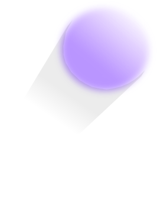

# Hue  
An application demonstrating color capabilities of the ncurses library 

Colors are read from a file which offers the advantage of changing up
the sequence of colors in any way desired.
Looking at the source code it is visibile that flexibilty was the main key 
behind the purpose of the project. For example, different sizes of rectangles can be set up and printed 
multiple times at different coordinates. 
Current project only demonstrates one shpe to view 
series of colors but new shapes can be added and managed easily.

## To run the program  
Make sure NUCRSES is installed and set up  
Clone and run make  
The run it by typing ./color  
### To change modes   
H - Right to Left  
J - Top to Bottom  
K - Bottom to Top  
L - Left to Right   

## Observations 
There were limitations. But it is not too much of a limitation but something to notice.
There can only be ONE DEFINITION of color at a time. Lets say you redefine color red and print something 
using that color, the moment you redefine the red, everything that was printed in red will be updated
to the new definition of red, which is sometimes be something you do not want. In order to lessen this
limitation, I used 6 different colors and redefined them, so they won't affect each other. In other
I was able to get 6 shades of one color in one time. Although, this project really doesn't push
the capabilities to the limits, it demonstrates what is possible. 

---
### Hue is part of [Concept](https://github.com/azimex/Concept) Series.
